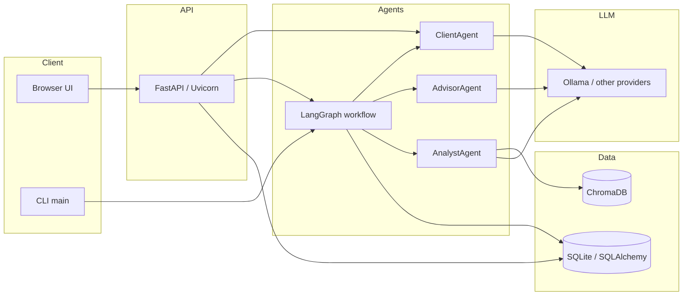
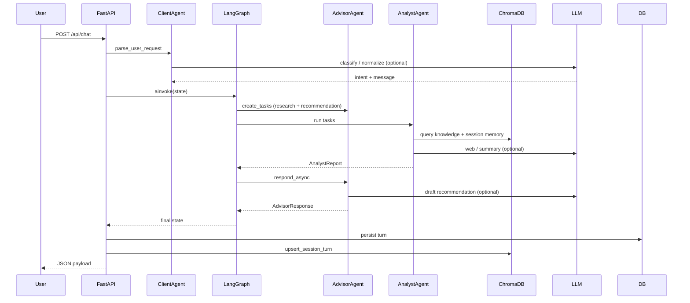

# Multi-Agent Investment Advisor

## Introduction

Multi-Agent Investment Advisor is a local-first, role-based advisory system that combines:

- deterministic portfolio metrics,
- retrieval-augmented context (ChromaDB + session memory),
- optional web-backed research,
- LLM-generated narrative recommendations.

It supports both CLI and web chat experiences, and is designed for iterative client-advisor-analyst reasoning.

## Key Features

- Multi-agent workflow (`ClientAgent`, `AdvisorAgent`, `AnalystAgent`) orchestrated with LangGraph
- ChromaDB-backed RAG for:
  - static knowledge base (`data/knowledge/market_primer.txt`)
  - session memory retrieval from prior turns
- Local LLM support via Ollama (`/v1` OpenAI-compatible endpoint)
- Profile-aware responses (especially legal/finance risk prompts)
- Intent parsing for user prompts (beginner / legal_risks / compare / general)
- Structured logging + per-call LLM timeout safeguards

## Architecture

### Agent Roles

- `ClientAgent`
  - parses and categorizes user request
  - can normalize prompt text for downstream agents
  - evaluates whether advisor response is resolved
- `AdvisorAgent`
  - creates analyst tasks
  - synthesizes analyst output with deterministic metrics
  - generates recommendation narrative (LLM + fallback logic)
- `AnalystAgent`
  - retrieves evidence from Chroma knowledge + session memory
  - optionally performs web-research LLM calls
  - returns summarized analyst report

### Runtime Flow

1. User message received (`/api/chat` or CLI)
2. `ClientAgent` parses intent and normalized request
3. `AdvisorAgent` creates analyst tasks (currently `research` + `recommendation`)
4. `AnalystAgent` retrieves evidence (Chroma + memory + optional web)
5. `AdvisorAgent` produces final recommendation
6. Turn is stored in DB + session memory collection

### Diagrams

High-level components and data stores:



Typical chat turn (simplified):



## Tech Stack

- Python 3.11+
- FastAPI + Uvicorn
- LangGraph
- ChromaDB
- Sentence Transformers
- SQLAlchemy + Alembic
- Pydantic / pydantic-settings
- OpenAI-compatible SDK clients (for Ollama and other providers)
- Pytest + Pytest-Asyncio (+ optional coverage)

## Project Structure

- `src/app/api.py` - web API and app lifecycle
- `src/app/main.py` - CLI entrypoint
- `src/app/graph/workflow.py` - multi-agent orchestration graph
- `src/app/agents/` - client/advisor/analyst agents
- `src/app/knowledge/chroma_store.py` - ChromaDB persistence and querying
- `src/app/finance/metrics.py` - deterministic portfolio calculations
- `src/app/static/index.html` - browser UI
- `tests/` - unit/integration-style tests

## Installation

From project root:

1. Create and activate virtual environment
   - `python3 -m venv .venv`
   - `source .venv/bin/activate`
2. Install package
   - `python -m pip install -e .`
3. (Recommended for dev/test tools) install extras
   - `python -m pip install -e ".[dev]"`
4. Create env file
   - `cp .env.example .env`

## Local LLM Setup (Ollama)

1. Start Ollama server (Terminal 1)
   - `ollama serve`
2. Pull lightweight model (one-time)
   - `ollama pull llama3.2:1b`
3. Configure `.env`
   - `OLLAMA_BASE_URL=http://127.0.0.1:11434/v1`
   - `ADVISOR_LLM=ollama:llama3.2:1b`
   - `CLIENT_LLM=ollama:llama3.2:1b`
   - `ANALYST_WEB_LLMS=ollama:llama3.2:1b`
   - `ANALYST_SUMMARY_LLMS=ollama:llama3.2:1b`

Notes:

- LLM spec format is `provider:model_name`
- Supported providers: `ollama`, `anthropic`, `openai`, `gemini`
- `LLM_TIMEOUT_SECONDS` is enforced per call (default `60`)

## Database + Migrations

Run from activated project venv:

- `python -m alembic upgrade head`

If `alembic` points to another Python environment, use the module form above.

## Run Tests (with Coverage)

Recommended before starting the app:

- `pytest --cov=app --cov-report=term-missing`

Run all tests:

- `pytest`

## Run the Application

### Web App

1. Ensure Ollama is running (if using local LLM)
2. Start server:
   - `advisor-web`
   - or `python -m app.api`
3. Open:
   - [http://127.0.0.1:8000](http://127.0.0.1:8000)

### CLI App

- `python -m app.main`

## HTTP API (curl examples)

Base URL (default): `http://127.0.0.1:8000`

Chat with a message (minimal body — uses server default client profile):

```bash
curl -s -X POST http://127.0.0.1:8000/api/chat \
  -H "Content-Type: application/json" \
  -d '{"message": "Give beginner advice for my portfolio."}'
```

Chat with session continuity (reuse `session_id` from the response on the next call):

```bash
curl -s -X POST http://127.0.0.1:8000/api/chat \
  -H "Content-Type: application/json" \
  -d '{
    "message": "What are legal and tax risks I should review?",
    "session_id": "YOUR_SESSION_UUID_FROM_PRIOR_RESPONSE"
  }'
```

Chat with inline client profile (must match `ClientProfile` schema: `name`, `age`, `risk_aversion`, `annual_income`, `liquid_assets`, `current_investments`, `goals`):

```bash
curl -s -X POST http://127.0.0.1:8000/api/chat \
  -H "Content-Type: application/json" \
  -d '{
    "message": "Should I rebalance?",
    "client_profile": {
      "name": "Jordan Lee",
      "age": 38,
      "risk_aversion": "moderate",
      "annual_income": 155000,
      "liquid_assets": 420000,
      "current_investments": [
        {"ticker": "SPY", "allocation_pct": 45, "expected_return": 0.08, "volatility": 0.16},
        {"ticker": "BND", "allocation_pct": 30, "expected_return": 0.04, "volatility": 0.06},
        {"ticker": "QQQ", "allocation_pct": 15, "expected_return": 0.1, "volatility": 0.22},
        {"ticker": "CASH", "allocation_pct": 10, "expected_return": 0.02, "volatility": 0.01}
      ],
      "goals": ["retire by 60", "maintain emergency buffer"]
    }
  }'
```

Fetch default server profile:

```bash
curl -s http://127.0.0.1:8000/api/profile
```

Create a new session id (optional helper; chat also returns `session_id`):

```bash
curl -s -X POST http://127.0.0.1:8000/api/session
```

OpenAPI docs (when server is running): [http://127.0.0.1:8000/docs](http://127.0.0.1:8000/docs)

## Performance Defaults

Current speed-focused defaults:

- `max_loops=1`
- `max_client_loops=1`
- analyst tasks per turn: `research` + `recommendation`

These reduce LLM round trips and improve latency.

## Configuration Reference

Common `.env` keys:

- `DATABASE_URL` - SQLAlchemy DB URL
- `CHROMA_DIR` - Chroma persistence path
- `EMBEDDING_MODEL` - sentence-transformers model
- `LLM_TIMEOUT_SECONDS` - max seconds per LLM call
- `ANALYST_WEB_LLMS` - analyst web/research provider chain
- `ANALYST_SUMMARY_LLMS` - analyst summarization provider chain
- `ADVISOR_LLM` - advisor narrative model
- `CLIENT_LLM` - client parser model

## Troubleshooting

- `ModuleNotFoundError: No module named 'app'`
  - activate project `.venv`
  - run `python -m pip install -e .`
- `422 Unprocessable Entity` on `/api/chat`
  - invalid `client_profile` JSON in UI sidebar; reset profile JSON
- Ollama port busy (`11434`)
  - identify listener: `lsof -nP -iTCP:11434 -sTCP:LISTEN`
  - stop old process, then restart `ollama serve`
- Slow first response
  - first-run embedding/model warm-up can take longer; subsequent requests are faster

## Disclaimer

This project provides educational guidance and technical experimentation. It is not legal, tax, or fiduciary investment advice.
